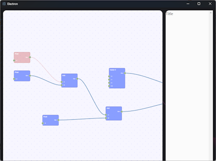

# graph-diff

A PoC of diff tool for graphs.



It transforms 2 graphs to an intermediate format, diffs these formats, and show results.
Green nodes are nodes that were added, red nodes that were removed, and yellow nodes are nodes with same id but with a different property.
Properties of node are converted to a JSON, and diff of selected node is shown on the right.

Currently supported file types:

- .shadergraph - Unity Shader Graph (it's only partially supported, I tested it on simple graphs only)

## How to use it

### Git

1. Add following to git `.config`

```
[difftool "graphdiff"]
	cmd = '<path>/graph-diff' -- --basePath=\"$LOCAL\" --newPath=\"$REMOTE\"
```

2. `git difftool -y -t graphdiff <file-to-diff>`

### Sourcetree

Go to external diff options and configure

1. Diff command `<path>/graph-diff`
2. Arguments `-- --basePath=\"$LOCAL\" --newPath=\"$REMOTE\"`
3. Right click on a file and select "External Diff"

## Recommended IDE Setup

- [VSCode](https://code.visualstudio.com/) + [ESLint](https://marketplace.visualstudio.com/items?itemName=dbaeumer.vscode-eslint) + [Prettier](https://marketplace.visualstudio.com/items?itemName=esbenp.prettier-vscode)

## Project Setup

### Install

```bash
$ npm install
```

### Development

```bash
$ npm run dev
```

### Build

```bash
# For windows
$ npm run build:win

# For macOS
$ npm run build:mac

# For Linux
$ npm run build:linux
```

### TODO

- better ui (different colors, dark mode)
- optionally add to PATH variable
- parse more complex unity graphs
- add support for Amplify graphs
- add possibility to publish it as a react webpage integrated with code review
- show before vs after view
- support groups and subgraphs