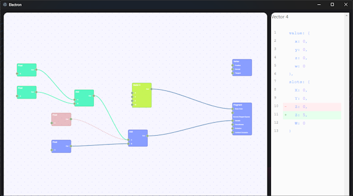

# graph-diff

A PoC of diff tool for graphs.



Currently supported file types:

- .shadergraph - Unity Shader Graph (it's only partially supported, I tested it on simple graphs only)

## How to use it

### Git

1. Add following to git `.config`

```
[difftool "graphdiff"]
	cmd = '<path>/graph-diff' -- --basePath=\"$LOCAL\" --newPath=\"$REMOTE\"
```

2. `git difftool -y -t graphdiff <file-to-diff>`

### Sourcetree

Go to external diff options and configure

1. Diff command `<path>/graph-diff`
2. Arguments `-- --basePath=\"$LOCAL\" --newPath=\"$REMOTE\"`
3. Right click on a file and select "External Diff"

## Recommended IDE Setup

- [VSCode](https://code.visualstudio.com/) + [ESLint](https://marketplace.visualstudio.com/items?itemName=dbaeumer.vscode-eslint) + [Prettier](https://marketplace.visualstudio.com/items?itemName=esbenp.prettier-vscode)

## Project Setup

### Install

```bash
$ npm install
```

### Development

```bash
$ npm run dev
```

### Build

```bash
# For windows
$ npm run build:win

# For macOS
$ npm run build:mac

# For Linux
$ npm run build:linux
```

### TODO

v 0.0.1

- show values of slots in unity graph

later

- optionally add to PATH variable
- create autopublish scripts
- parse more complex unity graphs
- add support for Amplify graphs
- add possibility to publish it as a react webpage integrated with code review
